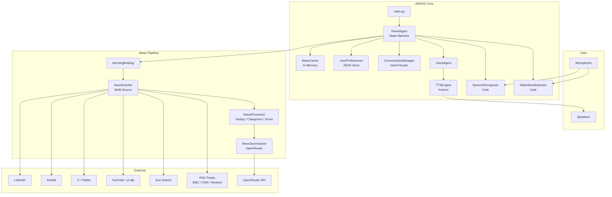

<div align="center">
  <h1>🗣️ JARVIS</h1>
  <p><strong>Local-first, voice-controlled AI news assistant</strong></p>
  <p><em>Say "Jarvis" — hear the news that matters.</em></p>
  <br/>
</div>

<p align="center">
  <a href="#-features">Features</a> •
  <a href="#-architecture">Architecture</a> •
  <a href="#-installation">Installation</a> •
  <a href="#-quick-start">Quick Start</a> •
  <a href="#-news-sources">News Sources</a> •
  <a href="#-voice-commands">Voice Commands</a> •
  <a href="#-environment-variables">Environment</a> •
  <a href="#-troubleshooting">Troubleshooting</a>
</p>

---

## 📋 Overview

JARVIS is a **local-first, voice-controlled news assistant** that lives on your machine. Say its name, ask for the latest technology headlines or world news, and it reads you a spoken briefing built from live sources.

Everything that can run locally **does** run locally:

- **Speech recognition** and **wake-word detection** via [Vosk](https://alphacephei.com/vosk/) (offline, open-source)
- **Speech synthesis** via [Kokoro](https://github.com/thewh1teagle/kokoro-onnx) (local neural TTS)
- **News fetching** from RSS feeds, YouTube, Exa, X/Twitter, Reddit, and LinkedIn
- **Article processing** with deterministic deduplication, categorization, and importance scoring
- **Optional AI enrichment** via OpenRouter (bring your own API key for LLM-powered summaries)

**Version:** 1.1 | **License:** MIT

---

## ✨ Features

### 🎤 Wake Word
Say **"Jarvis"** and JARVIS wakes up. No button to press, no hotkey to remember. Uses a grammar-restricted Vosk recognizer that only listens for the word "jarvis" — minimal CPU while idle.

### 🔄 Always-On Runtime
JARVIS runs as a persistent CLI process. It sleeps in the background using <2% CPU, waits for the wake word, handles your request, then goes back to sleep. No cloud dependency, no always-on server.

### 🗣️ Voice Conversations
Natural speech-driven interaction. Ask for news by category, navigate between stories, request deep-dives, and control the session — all by voice.

### ⚡ Streaming Responses
JARVIS starts speaking the moment the first important article arrives — it doesn't wait for all sources to finish. This means a sub-second time-to-first-word for most queries.

### 📰 Multi-Source News
| Source | Type | Auth Required | Status |
|--------|------|---------------|--------|
| **RSS** | BBC, CNN, Reuters | ❌ | ✅ Always active |
| **Exa** | AI-powered web search | ❌ | ✅ With `mcporter` |
| **YouTube** | Video search | ❌ | ✅ With `yt-dlp` |
| **X (Twitter)** | Social media | ✅ | Optional |
| **Reddit** | Community posts | ✅ | Optional |
| **LinkedIn** | Professional | ✅ | Optional (experimental) |

Sources degrade gracefully — if a CLI is missing or auth isn't configured, JARVIS simply skips that source and continues.

### 🧠 Conversation Context
Within a session, JARVIS remembers the stories it just read. You can say **"next"**, **"go back"**, **"tell me more about the first story"**, or **"repeat"** without re-fetching.

### 🤖 AI Summaries
Optional LLM enrichment via OpenRouter. Each top story gets:
- **One-line summary** — concise factual recap
- **Why it matters** — significance for readers
- **Possible impact** — near-term consequence

Toggle on/off with **"turn AI summaries off"**.

### ⚡ Smart Cache
Fetched and processed articles are cached in memory. Within the TTL (default: 5 minutes):
- **Fresh cache** → instant replay, zero I/O
- **Stale cache** → instant replay + background refresh (you never wait)
- **Cold miss** → fetch and stream normally

### 🔄 Background Refresh
JARVIS silently refreshes stale cache entries without interrupting you. The next time you ask for the same category, fresh data is ready.

### 👤 User Preferences
Tell JARVIS what you like and it remembers across restarts:
- Preferred categories (e.g., "I like AI news")
- Number of stories per briefing
- AI summaries on/off

Preferences are stored in `config/user_preferences.json` (git-ignored).

### 💤 Sleep Mode
Say **"go to sleep"** and JARVIS stops accepting commands until the next wake word. Perfect for ending a session without killing the process.

### 🔓 Wake Mode
Say **"Jarvis"** and JARVIS wakes up, acknowledging with **"Yes?"**, **"I'm listening."**, or **"Go ahead."** — randomly selected so it feels natural.

### 📊 Performance Metrics
On shutdown, JARVIS prints a metrics report:
```
============================================================
JARVIS RUNTIME METRICS
============================================================
Uptime:          845.3s
Sessions:        12
Wake cycles:     12
Wake latency:    avg=320ms p95=680ms max=1200ms
Idle CPU:        avg=1.2% max=4.5%
Idle Memory:     avg=210MB max=245MB
============================================================
```

### 🛑 Graceful Shutdown
`Ctrl+C` triggers a clean shutdown: the current utterance finishes, all resources are released, the RSS session is closed, and metrics are reported.

---

## 🏗️ Architecture



### State Machine

JARVIS runs as a simple three-state machine:

```
SLEEPING ──(hear "Jarvis")──▶ LISTENING ──(speak)──▶ SPEAKING
   ▲                            │   ▲                      │
   └──────(Stop / Sleep / idle)─┘   └──────(done speaking)─┘
```

- **SLEEPING** — Mic only listens for the wake word; ignores everything else. CPU usage drops to <2%.
- **LISTENING** — Accepts and routes voice commands through the conversation manager.
- **SPEAKING** — Producing audio; mic stays idle. Returns to LISTENING when done.

### Data Pipeline

```
Fetch (6 sources, concurrent) → Process (dedup · categorize · score · sort)
    → Summarize (LLM, top-N, optional) → Speak (streamed, instant first word)
```

### Shared Model Architecture

Both the wake-word detector and speech-to-text use a **shared Vosk model** and a **single audio input stream**:

- Model loaded once at startup (~50 MB)
- Single `RawInputStream` from `sounddevice`
- Wake word uses a grammar-restricted recognizer (only matches "jarvis")
- STT uses an unrestricted recognizer (full vocabulary)
- Stream management and lock serialization handled by `SharedVoskModel`

---

## 📁 Folder Structure

```
news-agent/
├── main.py                          # Entry point: env, UTF-8, run agent
├── requirements.txt                 # Pinned Python dependencies
├── .env                             # Your secrets (git-ignored, create from .env.example)
├── .env.example                     # Template for .env
├── LICENSE                          # MIT License
├── README.md                        # This file
│
├── config/
│   ├── mcporter.json                # MCP server config (Exa / LinkedIn)
│   └── user_preferences.json        # Your preferences (auto-created, git-ignored)
│
└── app/
    ├── agent/
    │   └── news_agent.py            # NewsAgent orchestrator + state machine
    │
    ├── agents/
    │   └── news_summarizer.py       # LLM enrichment via OpenRouter
    │
    ├── briefing/
    │   └── morning_brief.py         # Spoken briefing + streaming pipeline
    │
    ├── conversation/
    │   └── conversation_manager.py   # Rule-based intent router (no LLM)
    │
    ├── fetchers/
    │   └── news_fetcher.py          # Multi-source concurrent fetcher
    │
    ├── memory/
    │   └── news_cache.py            # TTL cache with background refresh
    │
    ├── models/
    │   └── news_article.py          # Pydantic data model
    │
    ├── preferences/
    │   └── user_preferences.py      # JSON-persisted user preferences
    │
    ├── processors/
    │   └── news_processor.py        # Dedup / categorize / score / sort
    │
    ├── voice/
    │   ├── engine.py                # TTSEngine abstract interface + factory
    │   ├── kokoro_tts.py            # Kokoro ONNX neural TTS
    │   ├── stt.py                   # Vosk speech-to-text
    │   └── voice_agent.py           # Speaking agent convenience layer
    │
    ├── wakeword/
    │   ├── engine.py                # WakeWordDetector abstract interface + factory
    │   ├── shared_model.py          # Shared Vosk model + audio stream manager
    │   └── vosk_wakeword.py         # Vosk wake-word detection
    │
    ├── api/                         # Reserved for future use
    ├── config/                      # Reserved for future use
    └── utils/                       # Reserved for future use
```

---

## 📦 Requirements

### Hardware

| Component | Requirement |
|-----------|-------------|
| **Microphone** | Required for voice interaction (briefing prints to console without one) |
| **Speakers** | Required for spoken output (text fallback if unavailable) |
| **RAM** | ~250 MB idle, ~350 MB during fetch + TTS |
| **Disk** | ~400 MB free (Vosk model ~50 MB, Kokoro model + voices ~300 MB) |
| **CPU** | Any x86-64 or ARM64 processor; modern Intel/AMD/Apple Silicon recommended |

### Software

| Requirement | Version |
|-------------|---------|
| **Operating System** | Windows 10/11 (primary target), Linux, macOS |
| **Python** | 3.14+ |
| **pip** | Latest (comes with Python) |

### Network

- **Internet connection** required for news fetching and LLM enrichment
- Core voice pipeline (TTS, STT, wake word) works **fully offline**

---

## 🚀 Installation

### Step 1: Clone the Repository

```bash
git clone https://github.com/<your-username>/news-agent.git
cd news-agent
```

### Step 2: Create a Virtual Environment

```bash
python -m venv .venv
```

**Activate it:**

| Platform | Command |
|----------|---------|
| **Windows (CMD)** | `.venv\Scripts\activate` |
| **Windows (PowerShell)** | `.venv\Scripts\Activate.ps1` |
| **macOS / Linux** | `source .venv/bin/activate` |

> You should see `(.venv)` prepended to your terminal prompt.

### Step 3: Install Dependencies

```bash
python -m pip install -r requirements.txt
```

### Step 4: Download Speech Models

This happens **automatically** on first run, but you can trigger it manually:

```python
# Pre-download Vosk model (~50 MB)
python -c "from app.voice.stt import _ensure_model; print(_ensure_model())"

# Pre-download Kokoro model + voices (~300 MB)
python -c "from app.voice.kokoro_tts import download_kokoro; print(download_kokoro())"
```

Model files are cached in `~/.cache/vosk/` and `~/.cache/kokoro/` respectively.

### Step 5: Configure Environment

```bash
cp .env.example .env
```

Edit `.env` with your API keys (see [Environment Variables](#-environment-variables)).

### Step 6: Install Optional Source CLIs (Recommended)

| Tool | Source | Install Command |
|------|--------|-----------------|
| **mcporter** | Exa + LinkedIn | `npm install -g mcporter` |
| **yt-dlp** | YouTube | `pip install yt-dlp` |
| **twitter-cli** | X/Twitter | See [X (Twitter) Setup](#x-twitter) |
| **rdt-cli** | Reddit | See [Reddit Setup](#reddit) |

### Step 7: Verify Installation

```bash
python -c "
import asyncio
from app.agent import NewsAgent
agent = NewsAgent()
print('✅ JARVIS imports OK')
print(f'  Wake word: {agent.wakeword.name}')
print(f'  TTS engine: {agent.voice.engine.name if agent.voice else \"(not started)\"}')
print(f'  Query: {agent.query}')
print(f'  Top stories: {agent.top_n}')
"
```

Expected output:
```
✅ JARVIS imports OK
  Wake word: vosk
  TTS engine: (not started)
  Query: technology news
  Top stories: 5
```

---

## ⚙️ Environment Variables

Copy `.env.example` to `.env` and fill in the values you need. **All variables are optional** — the core pipeline works without any of them.

### LLM Enrichment (OpenRouter)

| Variable | Default | Purpose |
|----------|---------|---------|
| `OPENROUTER_API_KEY` | — | Enables AI summaries, why-it-matters analysis, and possible-impact fields |
| `MODEL_NAME` | `openai/gpt-oss-120b:free` | Override the OpenRouter model |

> Get a free API key at [openrouter.ai/keys](https://openrouter.ai/keys). The default model is completely free.

### X / Twitter Authentication

| Variable | Purpose |
|----------|---------|
| `TWITTER_AUTH_TOKEN` | X/Twitter auth cookie (`auth_token`) |
| `TWITTER_CT0` | X/Twitter CSRF token cookie (`ct0`) |

### Engine Selection

| Variable | Default | Purpose |
|----------|---------|---------|
| `TTS_ENGINE` | `kokoro` | TTS engine name (currently only `kokoro`) |
| `WAKEWORD_ENGINE` | `vosk` | Wake-word engine name (currently only `vosk`) |

### .env.example

```bash
# --- LLM enrichment (OpenRouter) ---
# Get a key at https://openrouter.ai/keys
OPENROUTER_API_KEY=
# Override the model (default: openai/gpt-oss-120b:free)
MODEL_NAME=

# --- X / Twitter fetching (optional) ---
# Export these from the Cookie-Editor browser extension while logged into x.com.
TWITTER_AUTH_TOKEN=
TWITTER_CT0=

# --- Engine selection (optional) ---
# TTS engine name (default: kokoro)
TTS_ENGINE=kokoro
# Wake-word engine name (default: vosk)
WAKEWORD_ENGINE=vosk
```

---

## 📡 News Sources

### RSS (Built-in, No Setup)

JARVIS fetches from three RSS feeds out of the box — no configuration required:

- BBC News: `feeds.bbci.co.uk/news/rss.xml`
- CNN: `rss.cnn.com/rss/edition.rss`
- Reuters: `feeds.reuters.com/reuters/topNews`

To add more feeds, edit `rss_feeds` in `app/fetchers/news_fetcher.py`.

### Exa (Recommended, Minimal Setup)

[Exa](https://exa.ai/) provides an AI-powered web search API. No API key required when using the MCP bridge.

**Setup:**

```bash
# Install mcporter globally
npm install -g mcporter

# Add the Exa MCP server
mcporter config add exa https://mcp.exa.ai/mcp

# Verify
mcporter call 'exa.web_search_exa(query: "technology", numResults: 3)' --output json
```

The mcporter configuration is stored in `config/mcporter.json`.

### YouTube (Free, No API Key)

Uses `yt-dlp` to search YouTube. No API key or authentication required.

**Setup:**

```bash
pip install yt-dlp

# Verify
yt-dlp --dump-json --no-warnings "ytsearch3:technology news"
```

### X (Twitter)

> ⚠️ **Authentication is required.** X no longer allows anonymous API access.

**Why authentication is required:** JARVIS uses an unofficial CLI wrapper for X that relies on your browser session cookies. These cookies prove to X that you're a logged-in user.

**How to obtain cookies:**

1. Install a cookie extraction browser extension such as:
   - [Cookie-Editor](https://cookie-editor.com/) (Chrome, Firefox, Edge)
   - [EditThisCookie](https://www.editthiscookie.com/) (Chrome)

2. Log into [x.com](https://x.com) in your browser.

3. Open the Cookie-Editor extension and export cookies as JSON.

4. Find the following values:
   - `auth_token` — your session token
   - `ct0` — your CSRF token

5. Add them to your `.env` file:
   ```bash
   TWITTER_AUTH_TOKEN=your_auth_token_here
   TWITTER_CT0=your_ct0_here
   ```

**Alternative setup (OpenCLI Chrome extension):**

1. Install the [OpenCLI](https://opencli.co/) Chrome extension.
2. Open Chrome while logged into X.
3. The `twitter` CLI command should be available.

**Common errors:**

| Symptom | Likely Cause | Solution |
|---------|-------------|----------|
| `401 Unauthorized` | Expired auth_token | Re-export cookies and update `.env` |
| `skipped: twitter-cli not found` | twitter CLI not installed | Install OpenCLI extension or use cookie method |
| `skipped: X/Twitter needs auth` | Auth tokens missing | Set `TWITTER_AUTH_TOKEN` and `TWITTER_CT0` |
| `error: 429 Too Many Requests` | Rate limited | Wait 15 minutes before trying again |

**How to verify:**

```bash
# If using the twitter CLI directly
twitter search "technology news" -n 3 --json

# Or run JARVIS and check the console output:
# SOURCES: ... x:ok (3) ...
```

### Reddit

> ⚠️ **Authentication is required.** JARVIS uses the `rdt` CLI tool to search Reddit.

**Authentication options:**

1. **rdt-cli (recommended):**
   ```bash
   # Install rdt-cli
   npm install -g rdt-cli

   # Login (opens browser for OAuth)
   rdt login
   ```

2. **OpenCLI Chrome extension:**
   - Install the [OpenCLI](https://opencli.co/) Chrome extension
   - Open Chrome while logged into reddit.com

**How to verify:**

```bash
rdt search "technology" --limit 3 --json

# Or run JARVIS and look for:
# SOURCES: ... reddit:ok (3) ...
```

### LinkedIn

> ℹ️ **Optional.** LinkedIn fetching uses the `linkedin-scraper` MCP server via `mcporter`. It is currently experimental and may not return reliable results.

**Setup (if you want to try it):**

```bash
# Add the LinkedIn scraper MCP server
mcporter config add linkedin-scraper <server-url>

# Requires a LinkedIn session cookie
```

If not configured, JARVIS skips LinkedIn and prints:
```
SOURCES: ... linkedin:skipped: ...
```

---

## 🏃 First Run

### What to Expect

```bash
# Activate your virtual environment, then:
python main.py
```

**Startup sequence (console output):**

```
[shared] Vosk model loaded and audio stream started
[wakeword] Started - listening for 'JARVIS'
[state] sleeping -> speaking
[agent] Good morning! It's Monday, July 22, 2026, and the time is 8:30 AM.
[agent] Here are the top 5 technology news stories.
[agent] Story 1. [title]. [summary]
[agent] Story 2. [title]. [summary]
...
[agent] I analyzed 42 articles from across the web to find what matters most to you today.
[agent] Would you like technology news, startup news, world news, sports news, or AI news?
--------------------------------------------------------------------
SOURCES: rss:ok (18) | exa:ok (5) | youtube:ok (3) | x:skipped: ... | reddit:skipped: ... | linkedin:skipped: ...
SUMMARIZER: ok (5/5)
[state] speaking -> listening
[state] listening -> sleeping
[JARVIS] Sleeping - waiting for wake word 'JARVIS'...
```

**You'll hear:**

1. A greeting with the current day, date, and time
2. The top stories read aloud (streamed as they arrive)
3. A closing with the article count
4. Silence as JARVIS goes into wake-word listening mode

**To interact:**

Say **"Jarvis"** clearly into your microphone. JARVIS will respond with **"Yes?"** (or similar), then listen for your command.

> 💡 **Tip:** Speak clearly and at a moderate pace. The Vosk small model works best with clear enunciation.

### Troubleshooting First Run

| Symptom | Solution |
|---------|----------|
| `No module named 'vosk'` | Run `pip install -r requirements.txt` |
| `Model not found` | First run auto-downloads; ensure internet connectivity |
| Microphone not working | Check OS privacy settings for microphone access |
| No audio output | Check `sounddevice` configuration; speakers connected? |
| Slow startup | First run downloads models (~350 MB total); subsequent runs are fast |

---

## 🎙️ Voice Commands

JARVIS uses a **deterministic, rule-based** intent router — no LLM in the hot path. Commands are matched by keyword patterns, evaluated in priority order.

### Wake & Sleep

| Say… | What happens |
|------|--------------|
| **"Jarvis"** | Wakes from sleep mode, acknowledges, starts listening |
| **"Go to sleep"** / **"Sleep"** / **"Good night"** | Ends session, returns to wake-word listening |
| **"Stop"** / **"Goodbye"** / **"Exit"** | Ends session, returns to wake-word listening |

### News Categories

| Say… | Fetches |
|------|---------|
| **"Latest news"** / **"Headlines"** / **"What's new"** | Latest news (general) |
| **"Technology news"** / **"Tech news"** | Technology |
| **"AI news"** / **"Artificial intelligence"** | AI / ML |
| **"Startup news"** / **"Startups"** | Startups / venture |
| **"World news"** / **"Global news"** | World / international |
| **"Sports news"** | Sports |
| **"Business news"** | Business / corporate |
| **"Science news"** | Science / research |
| **"Politics news"** | Politics / government |
| **"Finance news"** / **"Markets"** | Finance / markets |

Category matching uses keyword aliases, so **"tech"**, **"technology"**, and **"software"** all trigger Technology news.

### Navigation

| Say… | What happens |
|------|--------------|
| **"Next"** / **"Skip"** / **"Continue"** | Read the next story |
| **"Previous"** / **"Back"** / **"Go back"** | Read the previous story |
| **"First story"** / **"Second one"** / **"Third article"** | Jump to that story |
| **"Tell me more"** / **"More"** | Deep-dive on the current story (summary + why it matters + possible impact) |
| **"Repeat"** / **"Say again"** / **"Once more"** | Hear the last thing JARVIS said again |

### Deep Dives

| Say… | What happens |
|------|--------------|
| **"Explain the first story"** | Deep-dive on story #1 |
| **"Tell me more about the second story"** | Deep-dive on story #2 |
| **"More on the third one"** | Deep-dive on story #3 |

Deep dives include:
- The story title
- One-line summary (or feed summary if AI enrichment is off)
- **Why it matters** (if AI enrichment is on)
- **Possible impact** (if AI enrichment is on)

### Briefing

| Say… | What happens |
|------|--------------|
| **"Good morning"** / **"Briefing"** / **"Brief me"** | Replays the full morning briefing with personalized order |

### Example Conversations

**Example 1: Quick news check**

```
You: "Jarvis"                       → JARVIS: "Yes?"
You: "What's the latest tech news?"  → JARVIS: reads top 5 tech stories
You: "Next"                          → JARVIS: reads story #2
You: "Tell me more about this one"   → JARVIS: deep-dive on story #2
You: "Go to sleep"                   → JARVIS: "Going to sleep."
```

**Example 2: Personalized briefing**

```
You: "Jarvis"                        → JARVIS: "I'm listening."
You: "Remember that I like AI news"  → JARVIS: "Got it - I'll remember you like ai news."
You: "Remember that I prefer technology first" → JARVIS: "Okay, I'll put technology first in your briefing."
You: "Read only three stories"       → JARVIS: "Got it - I'll read 3 stories at a time."
You: "Briefing"                      → JARVIS: runs personalized briefing with AI + tech first
```

**Example 3: Full session**

```
You: "Jarvis"                        → JARVIS: "Go ahead."
You: "World news"                    → JARVIS: reads top 5 world stories
You: "Second story"                  → JARVIS: reads story #2 in detail
You: "Explain the first story"       → JARVIS: deep-dive on story #1
You: "What do you remember about me?"→ JARVIS: "You like ai news, technology news. I read 3 stories at a time. AI summaries are on."
You: "Goodbye"                       → JARVIS: "Talk to you later."
```

---

## 👤 User Preferences

JARVIS remembers your preferences across restarts. Everything is stored in `config/user_preferences.json` (git-ignored).

### Preference Commands

| Command | Effect |
|---------|--------|
| **"Remember that I like AI news"** | Adds "AI" to preferred categories |
| **"Remember that I prefer technology first"** | Adds/moves "Technology" to front of briefing order |
| **"Read only three stories"** | Sets stories per briefing to 3 (range: 1–20) |
| **"Turn AI summaries on/off"** | Toggles LLM enrichment |
| **"What do you remember about me?"** | Recaps all saved preferences |
| **"Forget my preferences"** / **"Reset my preferences"** | Clears everything back to defaults |

### Stored Preferences File

```json
{
  "categories": ["ai", "technology"],
  "num_stories": 5,
  "ai_summaries": true
}
```

### How It Works

- Preferences are loaded from `config/user_preferences.json` on every startup
- If the file is missing or corrupt, safe defaults are used
- Every preference command writes changes atomically (temp file + replace)
- Categories are stored as canonical keys (`"ai"`, `"technology"`, etc.) and mapped to fetch queries internally
- The `briefing_queries()` method builds the ordered fetch list: preferred categories first, then the default query

---

## ⚡ Performance

### Streaming Pipeline

JARVIS speaks the moment an important article arrives — it doesn't wait for all six sources to finish. The pipeline:

1. Speaks the intro immediately
2. As each source finishes, processes and ranks its articles
3. If an article scores ≥55 importance, summarizes (if AI enabled) and speaks it right away
4. When all sources are done, the canonical top-N list is read in order
5. Empty sources or failed sources are skipped — never cause delays

### Caching Strategy

```
TTL: 300 seconds (configurable)

Cache hit (fresh) → Instant replay, zero I/O
Cache hit (stale) → Instant replay + background refresh
Cache miss        → Fetch + stream, populate cache
```

The cache uses a per-key `asyncio.Lock` so at most one background refresh runs per query.

### Shared Vosk Model

Both wake-word detection and speech-to-text share:

- **One Vosk model** (~50 MB, loaded once)
- **One audio input stream** (single `RawInputStream` from `sounddevice`)
- **Separate recognizers** (wake word: grammar-restricted, STT: unrestricted)

This reduces memory usage and avoids microphone contention.

### Expected Metrics

| Metric | Value |
|--------|-------|
| **Startup time (first run)** | ~30–60s (model downloads) |
| **Startup time (subsequent)** | ~2–5s |
| **Idle CPU** | <2% |
| **Idle memory** | ~210 MB |
| **Wake latency** | ~300 ms average |
| **Time to first word** | ~1–3s (depends on fastest source) |
| **Session memory** | ~250–350 MB |

---

## 🔧 Troubleshooting

### Vosk / Speech Recognition

| Issue | Cause | Solution |
|-------|-------|----------|
| `No module named 'vosk'` | Vosk not installed | `pip install vosk==0.3.45` |
| `Model not found` | Model not downloaded | Ensure internet on first run; models cache to `~/.cache/vosk/` |
| No speech recognized | Microphone not accessible | Check OS microphone permissions |
| Poor recognition accuracy | Background noise, accent, or quiet speech | Speak clearly; reduce background noise; ensure mic is not muted |
| `error: NoDefaultInputDevice` | No input device found | Check microphone connection; run `python -c "import sounddevice; print(sounddevice.query_devices())"` |
| Audio stream errors | Microphone busy | Close other apps using the mic; restart JARVIS |

### Kokoro / Text-to-Speech

| Issue | Cause | Solution |
|-------|-------|----------|
| `No module named 'kokoro_onnx'` | Kokoro not installed | `pip install kokoro-onnx==0.4.7` |
| Model not found | Model not downloaded | Auto-downloads on first use; check `~/.cache/kokoro/` |
| No audio output | No speaker/sound device | JARVIS falls back to printing text to console |
| Distorted audio | Sample rate mismatch | Ensure default audio device supports 24000 Hz |
| `os.startfile` fallback on Linux | sounddevice playback failed | Install `portaudio` (`apt install portaudio19-dev` or `brew install portaudio`) |

### Microphone / Audio

| Platform | Common Issues | Solution |
|----------|--------------|----------|
| **Windows** | Microphone blocked by privacy settings | Settings → Privacy & security → Microphone → Allow apps to access your microphone |
| **Windows** | Multiple audio devices | Set default input device in Sound settings |
| **Linux** | No ALSA/ PulseAudio | `sudo apt install pulseaudio` or `sudo apt install pipewire` |
| **Linux** | `sounddevice` no device | `pip install sounddevice` + `python -c "import sounddevice; print(sounddevice.query_devices())"` |
| **macOS** | Microphone permission denied | System Settings → Privacy & Security → Microphone → Allow Terminal |
| **macOS** | CoreAudio issues | Ensure terminal emulator has microphone access |

### X / Twitter Authentication

| Symptom | Likely Cause | Fix |
|---------|-------------|-----|
| `twitter-cli not found` | CLI not installed | Install via OpenCLI or use cookie-based auth |
| `X/Twitter needs auth` | Auth tokens missing | Set `TWITTER_AUTH_TOKEN` and `TWITTER_CT0` in `.env` |
| `401 Unauthorized` | Token expired | Re-export cookies from x.com and update `.env` |
| `429 Too Many Requests` | Rate limited | Wait 15 minutes |
| No tweets returned | Search query too narrow | Try a broader query |

### Reddit Authentication

| Symptom | Likely Cause | Fix |
|---------|-------------|-----|
| `rdt-cli not found` | CLI not installed | `npm install -g rdt-cli` |
| `rdt login` fails | OAuth issue | Ensure browser opens; try incognito mode |
| No posts returned | Subreddit restricted or query too narrow | Try a different query |

### Missing Models / First Run

| Symptom | Solution |
|---------|----------|
| Download hangs | Check internet connection; models are ~350 MB total |
| Download fails on Windows | Windows Defender may block; add exclusion or run in PowerShell as admin |
| Checksum error | Delete `~/.cache/vosk/` and `~/.cache/kokoro/` and retry |
| SSL certificate error | Update Python: `python -m pip install --upgrade certifi` |

### Python / Virtual Environment

| Issue | Solution |
|-------|----------|
| `Python 3.14+ required` | Check version: `python --version`. Install from python.org |
| `pip` not found | `python -m ensurepip --upgrade` |
| Virtual environment not activating | Windows: run `Set-ExecutionPolicy Unrestricted -Scope Process` before activating |
| Dependency conflicts | Create a fresh venv: `python -m venv .venv --clear` then reinstall |
| Unicode errors on Windows | `set PYTHONUTF8=1` before running; JARVIS also applies UTF-8 hardening automatically |

### Unicode / Encoding

JARVIS includes automatic UTF-8 stream hardening in `main.py` (`_install_utf8_streams()`) that:

- Sets `stdout` and `stderr` to UTF-8 encoding
- Uses `errors="replace"` so emoji-heavy headlines never crash
- Falls back to wrapping the binary buffer if `reconfigure()` is unavailable

If you still see encoding errors:

```bash
# Windows: set environment variable before running
set PYTHONUTF8=1
python main.py
```

### No Wake-Word Detection

| Possible Cause | Solution |
|---------------|----------|
| Microphone not working | Run `python -c "import sounddevice; print(sounddevice.query_devices())"` |
| Background noise | Speak clearly; move closer to mic |
| Model not loaded | Check console for `[shared] Vosk model loaded` |
| Audio device changed | Ensure default input device is set correctly |
| JARVIS already in LISTENING state | Console shows `[JARVIS] Listening...` — just speak your command |
| Sensitivity | The Vosk model uses a grammar-restricted recognizer; only "jarvis" triggers it |

### Slow Startup

| Cause | Solution |
|-------|----------|
| First run (model downloads) | Allow 30–60s; subsequent runs are ~2–5s |
| Slow internet connection | Models are ~350 MB; use a faster connection for first run |
| Large cache directory | Clear `~/.cache/vosk` and `~/.cache/kokoro` and re-download if corrupted |
| Heavy antivirus scanning | Exclude the project directory and cache directories from real-time scanning |

### API Limits

| Service | Limit | Mitigation |
|---------|-------|------------|
| **OpenRouter (free tier)** | ~20 requests/minute, ~200/day | Use a paid tier or add `OPENROUTER_API_KEY` with a paid model |
| **Exa (free)** | ~100 searches/month | Exa is subject to changes; consider RSS as a reliable fallback |
| **X/Twitter** | Variable; aggressive rate limiting | Reduce `max_per_source` |

### Common Stack Traces

**Stack trace: `VoskError: Model not found`**

```
[stt] downloading vosk-model-small-en-us-0.15 ...
...
VoskError: Model not found
```

**Fix:** Delete `~/.cache/vosk/` and re-run. Ensure internet connectivity for the download.

**Stack trace: `sounddevice.PortAudioError: Error opening InputStream`**

```
PortAudioError: Error opening InputStream
```

**Fix:** Check that your microphone is connected and not busy. On Windows, check privacy settings. On Linux, install `portaudio19-dev`.

**Stack trace: `aiohttp.ClientConnectorError` during RSS fetch**

```
aiohttp.client_exceptions.ClientConnectorError: Cannot connect to host feeds.bbci.co.uk
```

**Fix:** Check your internet connection. RSS feeds are rate-limited; wait a few minutes and retry.

---

## ❓ FAQ

**Q: Do I need an API key to use JARVIS?**

A: No. The core pipeline (wake word, speech-to-text, text-to-speech, RSS fetching, processing, and speaking) works fully offline with no API keys. Only AI summaries require an OpenRouter API key.

**Q: Does JARVIS upload my voice or conversations to the cloud?**

A: No. Speech recognition and wake-word detection run entirely locally via Vosk. Text-to-speech runs locally via Kokoro. Only news fetching and optional AI summaries make network requests.

**Q: Can I use JARVIS without a microphone?**

A: Yes. The briefing is always printed to the console. Voice commands require a microphone, but all output appears as text too.

**Q: Why does JARVIS use so much memory (~200 MB)?**

A: Vosk loads a full language model (~50 MB) into memory. Kokoro loads an ONNX model + voice data (~100 MB). Python itself accounts for the rest. This is normal for local speech models.

**Q: How do I add more RSS feeds?**

A: Edit the `rss_feeds` list in `app/fetchers/news_fetcher.py`. Add any feed URL that produces standard RSS/Atom XML.

**Q: Can I change the voice?**

A: The default voice is `af_heart`. You can change it in `app/voice/kokoro_tts.py` by modifying the `_DEFAULT_VOICE` constant. Kokoro supports multiple voices built into the `voices.bin` file.

**Q: Can I add new TTS or wake-word engines?**

A: Yes. Implement the `TTSEngine` or `WakeWordDetector` abstract interface, drop the module in the appropriate folder, and set `TTS_ENGINE=<name>` or `WAKEWORD_ENGINE=<name>` in `.env`.

**Q: Does JARVIS work on macOS/Linux?**

A: Yes, though Windows is the primary development target. macOS and Linux should work but are less tested. Audio device handling differs between platforms.

**Q: What if I want to run JARVIS headless (no speakers)?**

A: JARVIS automatically falls back to printing text to the console if audio playback fails. All output is always printed regardless of audio.

**Q: How do I stop JARVIS completely?**

A: Press `Ctrl+C` in the terminal where JARVIS is running. It will perform a graceful shutdown, releasing all resources.

**Q: Does JARVIS remember what I said between sessions?**

A: No. Conversation context is per-session only. The next time you wake JARVIS, it starts with a blank slate. Only user preferences (categories, story count, AI toggle) persist across restarts.

**Q: Can I change the wake word?**

A: Not currently. The wake word is hardcoded as "jarvis" in the Vosk grammar. This could be customized in a future version.

---

## 💻 Development

### Contributing

Contributions are welcome! Please follow these guidelines:

1. **Open an issue** first to discuss proposed changes
2. **Follow the existing code style** — the project uses consistent patterns
3. **Add or update tests** for your changes
4. **Run the linter** and ensure no new warnings

### Coding Style

- **Type annotations** — All functions and methods must have type annotations (`from __future__ import annotations`)
- **Async-first** — I/O operations use `asyncio`; blocking operations run in worker threads via `asyncio.to_thread`
- **Error handling** — Prefer graceful degradation over crashing: sources fail silently, the summarizer degrades, preferences fall back to defaults
- **Logging** — Use `print()` with structured prefixes: `[component] message`
- **State machines** — The `AgentState` enum drives all lifecycle transitions; state transitions are logged

### Project Architecture Principles

1. **Separation of concerns:**
   - `NewsAgent` orchestrates but doesn't fetch, process, or speak directly
   - `NewsFetcher` fetches but doesn't process or speak
   - `NewsProcessor` processes but doesn't fetch or speak
   - Each component owns exactly one responsibility

2. **Pluggable engines:**
   - TTS engines implement `TTSEngine` (in `app/voice/engine.py`) and are loaded by name
   - Wake-word engines implement `WakeWordDetector` (in `app/wakeword/engine.py`) and are loaded by name
   - Adding a new engine = one file + one factory entry point

3. **Graceful degradation:**
   - Every source handles missing CLIs and authentication errors
   - The summarizer handles missing API keys, rate limits, and parse errors
   - Preferences handle corrupt JSON files
   - Audio handles missing devices

4. **Deterministic routing:**
   - The conversation manager uses pure keyword/rule matching — no LLM in the hot path
   - Intent priority is explicit and ordered

### Running Tests

```bash
# From the project root with the virtual environment activated
python -m pytest

# Run with verbose output
python -m pytest -v

# Run a specific test file
python -m pytest tests/test_processor.py -v
```

### Creating a New News Source

1. Add a `_fetch_<source>()` method to `NewsFetcher` in `app/fetchers/news_fetcher.py`
2. Add the source name to `_SOURCES` in `app/briefing/morning_brief.py`
3. Add any required CLI resolution to `_resolve()` or the `_run_cli` method
4. Handle missing CLIs and auth errors gracefully (return `[]` and set `status`)
5. Add documentation for the new source in this README

---

## 🗺️ Roadmap

### ✅ Completed (V1)

- [x] Local wake-word detection (Vosk)
- [x] Local speech-to-text (Vosk)
- [x] Local neural TTS (Kokoro)
- [x] Multi-source concurrent fetching (RSS, Exa, YouTube, X, Reddit, LinkedIn)
- [x] Deterministic deduplication, categorization, and importance scoring
- [x] Streaming pipeline (instant first word)
- [x] Optional LLM enrichment via OpenRouter
- [x] Session conversation context (next/previous/select/tell-more/repeat)
- [x] Long-term user preferences (JSON-persisted)
- [x] Smart cache with background refresh
- [x] Three-state lifecycle (SLEEPING/LISTENING/SPEAKING)
- [x] Graceful degradation across all sources
- [x] Graceful shutdown with metrics reporting
- [x] UTF-8 stream hardening for cross-platform Unicode support
- [x] Shared Vosk model (single model + stream for wake word and STT)
- [x] Signal handler installation for clean Ctrl+C handling

### 🔮 Future (V2 Ideas)

- [ ] HTTP API (`app/api`) for programmatic access
- [ ] Persistent article store (`app/memory`)
- [ ] Settings configuration loader (`app/config`)
- [ ] Web UI
- [ ] Additional TTS engines (e.g., Piper, Coqui)
- [ ] Additional wake-word engines (e.g., openWakeWord, Porcupine)
- [ ] Richer "explain" follow-ups with source attribution
- [ ] Cross-platform audio device management
- [ ] Custom wake-word registration
- [ ] Multi-language support
- [ ] Podcast mode (long-form spoken summaries)
- [ ] Docker deployment

---

## 📜 License

Released under the [MIT License](LICENSE).

Copyright (c) 2026 RITHWAK

Permission is hereby granted, free of charge, to any person obtaining a copy of this software and associated documentation files (the "Software"), to deal in the Software without restriction, including without limitation the rights to use, copy, modify, merge, publish, distribute, sublicense, and/or sell copies of the Software, and to permit persons to whom the Software is furnished to do so, subject to the following conditions.

The above copyright notice and this permission notice shall be included in all copies or substantial portions of the Software.

THE SOFTWARE IS PROVIDED "AS IS", WITHOUT WARRANTY OF ANY KIND, EXPRESS OR IMPLIED.

---

## 🙏 Acknowledgements

JARVIS stands on the shoulders of these incredible open-source projects:

| Library | Purpose |
|---------|---------|
| [Vosk](https://alphacephei.com/vosk/) | Offline speech recognition and wake-word detection |
| [kokoro-onnx](https://github.com/thewh1teagle/kokoro-onnx) | Local neural text-to-speech |
| [sounddevice](https://python-sounddevice.readthedocs.io/) | Cross-platform audio I/O |
| [feedparser](https://feedparser.readthedocs.io/) | Universal RSS/Atom feed parsing |
| [Pydantic](https://docs.pydantic.dev/) | Data validation and models |
| [OpenAI Python SDK](https://github.com/openai/openai-python) | LLM API client (OpenRouter-compatible) |
| [OpenRouter](https://openrouter.ai/) | Unified LLM API gateway |
| [aiohttp](https://docs.aiohttp.org/) | Async HTTP client |
| [python-dotenv](https://github.com/theskumar/python-dotenv) | Environment variable loading |
| [yt-dlp](https://github.com/yt-dlp/yt-dlp) | YouTube search |
| [Exa](https://exa.ai/) | AI-powered web search |
| [mcporter](https://github.com/mcporter/mcporter) | MCP server CLI client |
| [NumPy](https://numpy.org/) | Audio data processing |
